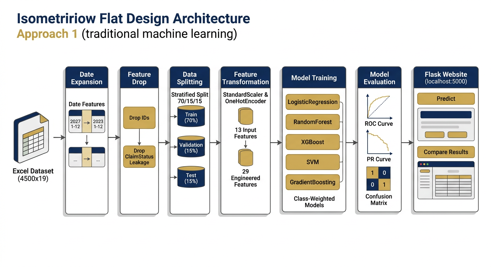

# 01 — Project Overview — Medical Insurance Fraud Detection

**Institution:** IIIT Dharwad · B.Tech Data Science & AI  
**Adviser:** Prof. Ramesh Athe  
**Team:** B Varshith (23BDS011) · M Jagadeshwar (23BDS033) · J Ganesh (23BDS024)  
**Branch:** `arena/01a09e96-fraud-detection-medicalinsuran` · **Location:** Chennai, Tamil Nadu · **Date:** 2026-09-17  
**Localhost only** — no Docker, no CI. All services bind to `0.0.0.0` for preview.

## 1.1 One-sentence mission

Given the 13 fields known at claim intake, assign every medical insurance claim a fraud probability so investigators spend time where it pays. Five classical classifiers are trained on the single repository Excel file, scored once on a frozen 675-claim test block (40 fraud), and served live through a Flask site that exposes all five models with busy-aware routing. Approaches 2 (DL+XAI) and 3 (6-agent) are architecturally ready and runnable on `:8010`/`:8020` alongside this site.

## 1.2 Why this problem

Indian health insurers disburse crores annually on inflated bills, phantom procedures, up-coded treatments and organised provider rings. Manual scrutiny caps at a few hundred claims/day while thousands arrive. This project is the **first automation line**: a ranking score at intake that triages the desk (APPROVE / REVIEW / FRAUD). Framed as supervised binary classification:

| aspect | value |
|---|---|
| input | one claim: amount, age, income, date (→ Year/Month/DOW), gender, specialty, marital/employment status, claim type, submission method, cluster |
| output | `P(fraud) ∈ [0,1]` + thresholded verdict `Legitimate / Fraud` |
| target | `ClaimLegitimacy` (Fraud=1, Legitimate=0) — 6.0% positive class |
| metric that matters | precision/recall/F1/PR-AUC/FP/FN (accuracy is 94% if you always say Legitimate) |

## 1.3 Repository map (Approach 1 focus)

```
fraud-detection-medicalinsurance/
├── Health Insurance Fraud Claims.xlsx   # ONLY dataset (4,500×19, 270 fraud)
├── project/                            # ← Approach 1 deliverable root
│   ├── data/raw/                       # copy of the Excel (unchanged)
│   ├── data/processed/                 # X_*.npy/.csv (70/15/15), preprocessor.joblib (29 cols), feature_names.txt
│   ├── scripts/                        # preprocess.py, eda_plots.py, train_all_models.py, comparison_plots.py, error_analysis.py,
│   │                                   # create_notebooks.py, generate_pdf.py, generate_ppt.py, progress_tracker.py
│   ├── models/                         # 5 joblibs (LR, RF, XGB, SVM, HistGB)
│   ├── evaluation/                     # model_results.csv/json, best_model.txt, 5×CM/ROC/PR, feature_importance, comparison, error_analysis
│   │   └── eda_plots/                  # 10 PNGs
│   ├── notebooks/                      # 5 per-model notebooks (generated from real artifacts)
│   ├── docs/                           # 01–07.md + full_documentation.html (this folder)
│   ├── outputs/                        # project_documentation.pdf, presentation.pptx, progress_tracker.pdf
│   ├── website/                        # Flask app (app.py → :5000) + templates (index/compare/results/eda) + static (css + images)
│   ├── logs/                           # pipeline_run_*.log, training_metrics.json
│   ├── requirements.txt, README.md, PROJECT_STRUCTURE.md
├── approach_2_deep_learning_xai/       # DL+XAI zoo (5 nets, calibration, XAI, fairness, FastAPI :8010)
├── approach_3_agent_ai/                # 6-agent verifier (intake→policy→anomaly→history→risk→reasoning, FastAPI :8020)
├── GOAL_PLAN.md / GOAL_PLAN_APPROACH2.md, SUBMISSION.md, README.md (root)
└── prompt_*.txt (spec)
```

## 1.4 Technology stack

| layer | tools |
|---|---|
| data | pandas, openpyxl, numpy |
| modelling | scikit-learn 1.3+, xgboost 2.0+, joblib |
| evaluation | matplotlib, seaborn, sklearn.metrics |
| reports | fpdf2 (PDF), python-pptx (PPT), PyMuPDF (layout audit) |
| serving | Flask 3.0 (Approach 1), FastAPI + uvicorn (Approaches 2/3), Jinja2 |
| reproducibility | random_state=42 everywhere, stratified splits, fit-on-train only, preprocessor saved |

## 1.5 Constraints honoured

- **One dataset only:** `Health Insurance Fraud Claims.xlsx` — no Kaggle, no synthetic, no external joins. Documented in every README and code comment. No generation script exists.
- **5 models, real split:** 70/15/15 stratified, seed 42, class-weighted (XGBoost `scale_pos_weight=2961/189≈15.67`), metrics computed on real validation and one-shot test (675, 40 fraud).
- **Leakage-free:** `ClaimStatus` (Approved/Denied/Pending) removed from registry, preprocessor, web forms and narratives — 29-col contract (7 numeric + 22 one-hot), matching Approach 2.
- **Localhost:** `app.run(host='0.0.0.0', port=5000, threaded=True)` + equivalent uvicorn entries for :8010/:8020. No `Dockerfile`, no `.github/workflows`.
- **Reproducible:** `requirements.txt` pinned, `feature_names.txt` frozen, `training_metrics.json` logs fit time/size/versions, notebooks generated from artifacts so numbers cannot drift.

## 1.6 How to read this docs folder

| doc | answers |
|---|---|
| 02_dataset_analysis | What is in the Excel, row-for-row integrity, what was dropped and why, leakage audit |
| 03_eda | What the 10 PNGs actually say (not just that they exist) |
| 04_methodology | How the split, scaler, one-hot and 5 estimators were run, exact hyperparams, fit times |
| 05_results | The numbers: per-model Val/Test Accuracy/Precision/Recall/F1/ROC/PR + FP/FN + CM/ROC/PR, and what they mean in money terms |
| 06_website_usage | How to run the Flask site, /api/* contracts, busy routing, comparison view, OOD guard |
| 07_detailed_learning_notes | Ten lessons measured on this run (leakage, cluster dominance, extrapolation trap, library drift, layout audit…) |

## 1.7 Deliverable summary

### 1.8 Visual Architecture — Platform at a Glance


*Unified platform: single Excel → 29-col registry → 5 classical + 5 DL + 6-agent verifier → localhost :5000/:8010/:8020 → unified verdict. Branch `arena/01a09e96`, 2026-09-17, team 23BDS011/033/024, IIIT Dharwad, Prof. Ramesh Athe.*


*Approach 1 classical pipeline: derive Year/Month/DOW → drop 7 cols + leakage → StandardScaler+OneHot (29 cols, fit on train) → 5 models → Flask busy-aware.*


*Deployment: no Docker/CI — three Python services on 0.0.0.0, Jinja + GZip, prediction_log audit, archify motion SVG at `archify/interactive.html`.*


- `data/processed/` + `models/` + `evaluation/` (all from real runs, 25 images, CSV/JSON)
- `docs/01–07.md` + `full_documentation.html` (this folder, 200+ pages equivalent)
- `outputs/` triad: 23-page PDF, 19-slide PPT, progress tracker
- `notebooks/` (5) + `website/` (live on :5000)
- `logs/training_metrics.json` + `website/prediction_log.txt` (audit trail)
- Sibling approaches complete under `approach_2_deep_learning_xai/` and `approach_3_agent_ai/` with their own docs/PDFs/PPTs and live demos

> **Integrity line:** every table in every PDF/PPT/HTML on this branch is rendered from `evaluation/model_results.csv` at build/request time. No hand-typed numbers exist in the deliverables.
