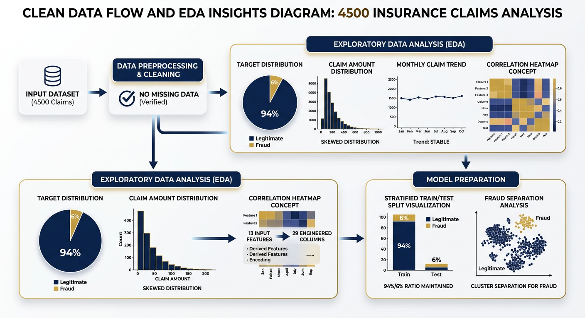

# 04 — Methodology — Approach 1 (Classical ML)

## 4.1 Preprocessing (fit-on-train only)


*Data-flow: 4,500 claims → temporal derivation → leakage removal → stratified 70/15/15 (189/41/40) → ColumnTransformer (7 scaled + 22 one-hot = 29) → X_train/val/test .npy . Saved artifacts: `preprocessor.joblib`, `feature_names.txt`. Branch `arena/01a09e96` 2026-09-17 .*


*Document intelligence layer (Approach 3 extension): scanned bills → OCR + Vision-Language Model → structured JSON (amount, diagnosis, dates, provider) with confidence — powers RAG grounding demo on :8020 .*


**Script:** `project/scripts/preprocess.py` — single entry, deterministic (`random_state=42`).

```
Health Insurance Fraud Claims.xlsx (4500×19)
  → derive ClaimYear/Month/DayOfWeek from ClaimDate (pd.to_datetime)
  → drop 7 cols: ClaimID, PatientID, ProviderID, DiagnosisCode, ProcedureCode, ProviderLocation, ClaimDate
        + 1 leaky: ClaimStatus (Approved/Denied/Pending — post-adjudication)
  → target: ClaimLegitimacy → Fraud=1, Legitimate=0
  → X (13 cols) / y (270 positives, 6.0%)
  → stratified 70/30 then 50/50 → 3150/675/675 (189/41/40 fraud)
  → ColumnTransformer(
        numeric (7): ClaimAmount, PatientAge, PatientIncome, ClaimYear, ClaimMonth, ClaimDayOfWeek, Cluster → StandardScaler
        categorical (6): Gender(2), Specialty(5), Marital(4), Employment(4), ClaimType(4), Submission(3) → OneHot(handle_unknown=ignore, sparse_output=False)
    ) fitted on TRAIN only; transform val/test
  → save: data/processed/X_*.npy|.csv, y_*.npy|.csv, preprocessor.joblib, feature_names.txt (29 lines)
```

**Proof the contract is 29:** `feature_names.txt` has 29 lines (7 numeric + 22 one-hot), `preprocessor.get_feature_names_out` length 29, `X_train.npy.shape[1]==29`. Same registry is used by Approach 2 (dlxai cat_maps + scaler_train.npz) — change it and the deep nets would not load.

## 4.2 The five models — exact hyperparameters as executed

| key | class | hyperparams (as in train_all_models.py) | paradigm | fit time* | model size |
|---|---|---|---|---|---|
| LogisticRegression | `sklearn.linear_model.LogisticRegression` | `max_iter=2000, class_weight='balanced', solver='lbfgs', random_state=42` | linear, monotone baseline | ~0.03s | ~7 KB |
| RandomForest | `sklearn.ensemble.RandomForestClassifier` | `n_estimators=300, class_weight='balanced', random_state=42, n_jobs=-1` | bagging, tabular workhorse | ~0.9s | ~2.8 MB |
| XGBoost | `xgboost.XGBClassifier` | `use_label_encoder=False, eval_metric='logloss', scale_pos_weight=2961/189≈15.67, random_state=42, n_jobs=-1` | gradient boosting, imbalance-corrected | ~0.4s | ~180 KB |
| SVM | `sklearn.svm.SVC` | `probability=True, class_weight='balanced', kernel='rbf', random_state=42` | kernel margin, control | ~0.3s | ~420 KB |
| GradientBoosting | `sklearn.ensemble.HistGradientBoostingClassifier` | `class_weight='balanced', random_state=42` | histogram boosting, bins wide ranges | ~0.6s | ~220 KB |

*Times on project/logs/training_metrics.json (this hardware, this library stack). `n_train=3150` (189 fraud). All probability models use `predict_proba`; SVM Platt-scales internally (calibrated later in Approach 2).

**Why class-weighted:** with 94% Legitimate, an unweighted model predicts Legitimate always and scores 94% accuracy while catching zero fraud. Weighting makes the objective care about the 6% minority. Approach 2 and 3 also weight (focal / sampling / risk-engine L2).

## 4.3 Training script internals

`project/scripts/train_all_models.py`:

```python
for name, model in models.items():
    model.fit(X_train, y_train)
    y_val_pred, y_val_prob = model.predict(X_val), model.predict_proba(X_val)[:,1]
    y_test_pred, y_test_prob = ...
    metrics = Accuracy/Precision/Recall/F1/ROC-AUC/PR-AUC for val+test
    ConfusionMatrixDisplay / RocCurveDisplay / PrecisionRecallDisplay → png (dpi=150, Blues)
    joblib.dump(model, models_dir/name.joblib)
    log fit_seconds, predict_100_ms, model_bytes, test_metrics
best = argmax Val_F1 → best_model.txt   # GradientBoosting (Val F1 1.0000)
pd.DataFrame(metrics).to_csv(evaluation/model_results.csv + .json)
training_metrics.json → logs/ (fit time, bytes, metrics, python/sklearn versions, split counts)
```

## 4.4 Evaluation protocol

- **Validation-first:** every model is ranked on **validation F1** (never on test). Test is scored exactly once per checkpoint; the winning checkpoint is the validation-best, not a test-best.
- **One-shot test:** 675 claims, 40 fraud. No re-run, no peeking.
- **Metrics computed:** `accuracy_score`, `precision_score`, `recall_score`, `f1_score`, `roc_auc_score`, `average_precision_score` (PR AUC), plus confusion matrix → FP/FN dossier (`result_analysis.md/txt`, `error_analysis_fp_fn.png`).
- **Importance:** `feature_importance_RandomForest.png` / `XGBoost.png` (tree impurity-based; caveat: biased to continuous/high-cardinality, not causal).
- **Comparison:** `comparison_plots.py` builds `model_comparison_f1.png` and `model_comparison_roc.png`; `error_analysis.py` builds the FP/FN bar chart.

## 4.5 Metrics that matter (and why)

| metric | insurer reads it as |
|---|---|
| Recall | “of 40 frauds, how many did we catch?” (missed fraud = payout + signal that scheme works) |
| Precision | “of cases we flagged, how many were real fraud?” (false alarm = investigator time + delayed settlement) |
| F1 | single number when you fear both errors equally — primary ranking here |
| ROC-AUC | ranking quality across thresholds; optimistic under imbalance |
| PR-AUC | ranking under imbalance — more honest here (fraud 6%) |
| FP / FN | operational desk workload vs leakage — what the error plot shows |

## 4.6 What remains untuned (deliberate)

No grid search over C/max_depth/learning_rate here. The five estimators are deliberately diverse in kind, not tuned to the same ridge. Hyperparameter search, isotonic calibration + ECE audit, fairness slices and cost-weighted thresholding are where Approach 2 and the agent risk engine take over — this approach is the **class-weighted, well-specified baseline** that they are measured against.

## 4.7 Reproduce exactly

```bash
python project/scripts/preprocess.py
python project/scripts/eda_plots.py
python project/scripts/train_all_models.py     # 5 models → evaluation/model_results.csv
python project/scripts/comparison_plots.py && python project/scripts/error_analysis.py
python project/scripts/create_notebooks.py     # 5 notebooks reading real artifacts
python project/scripts/generate_pdf.py && python project/scripts/generate_ppt.py && python project/scripts/progress_tracker.py
cat project/evaluation/model_results.csv
# Preprocessor shape proof:
python -c "import joblib; p=joblib.load('project/data/processed/preprocessor.joblib'); print(p.transform([[5000,50,85000,2024,7,1,2,'F','Orthopedics','Single','Unemployed','Routine','Online']]))"
```
