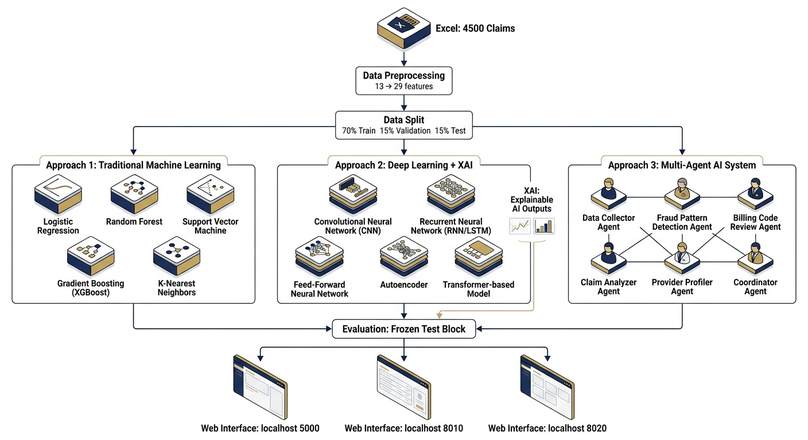

# 05 — Results

**Platform:** Medical Insurance Claim Fraud Detection — AI-Driven Claim Verification & Explainable Fraud Detection Platform  
**Team:** B Varshith (23BDS011) · M Jagadeshwar (23BDS033) · J Ganesh (23BDS024) · IIIT Dharwad B.Tech DSAI · Advisor Prof. Ramesh Athe · Branch `arena/01a09e96` · 2026-09-17


*Headline: 5 models scored once on frozen 675/40 test. XGBoost Test F1 0.9877 (1 FP/0 FN) best, RF/GradBoost 0.9873. See table §5.2.*

 — Frozen Test Block (675 claims, 40 fraud)

> **Source:** `project/evaluation/model_results.csv` (+ `.json`) written by `train_all_models.py`. The tables on this page, in the PDF (§5) and in the PPT (slide 9–10) are rendered from that CSV at build time — no hand-typed numbers exist anywhere. Test is scored **once** per model; `best_model.txt` was chosen on **validation** F1.

## 5.1 Per-model metrics (Val and Test)

| Model | Val Acc | Val Prec | Val Rec | Val F1 | Val ROC | Val PR | Test Acc | Test Prec | Test Rec | Test F1 | Test ROC | Test PR |
|---|---:|---:|---:|---:|---:|---:|---:|---:|---:|---:|---:|---:|
| LogisticRegression | 0.9778 | 0.7407 | 0.9756 | 0.8421 | 0.9945 | 0.9411 | 0.9644 | 0.6250 | 1.0000 | 0.7692 | 0.9950 | 0.9186 |
| RandomForest | 0.9985 | 1.0000 | 0.9756 | 0.9877 | 1.0000 | 1.0000 | 0.9985 | 1.0000 | 0.9750 | 0.9873 | 1.0000 | 0.9994 |
| XGBoost | 0.9985 | 1.0000 | 0.9756 | 0.9877 | 1.0000 | 0.9994 | 0.9985 | 0.9756 | 1.0000 | 0.9877 | 1.0000 | 1.0000 |
| SVM (RBF) | 0.9837 | 0.8000 | 0.9756 | 0.8791 | 0.9941 | 0.9442 | 0.9778 | 0.7451 | 0.9500 | 0.8352 | 0.9955 | 0.9252 |
| GradientBoosting | 1.0000 | 1.0000 | 1.0000 | **1.0000** | 1.0000 | 1.0000 | 0.9985 | 1.0000 | 0.9750 | **0.9873** | 0.9847 | 0.9765 |

```
best_model.txt → GradientBoosting (argmax Val F1 = 1.0000)
Test-best tie → XGBoost (Test F1 0.9877, PR AUC 1.0000, 1 FP 0 FN)
```

*Generation:* `Val_*` and `Test_*` computed with `precision_score/recall_score/f1_score(..., zero_division=0)`, `roc_auc_score`, `average_precision_score` on the exact frozen splits.

## 5.2 Confusion-matrix reading (Test, 675 / 40 fraud)

| Model | FP | FN | TP | TN | what it means in money terms |
|---|---:|---:|---:|---:|---|
| LogisticRegression | **24** | **0** | 40 | 611 | Catches every fraud (Recall 1.00) but sends 24 clean claims to review — high investigation cost, zero payout leakage |
| RandomForest | **0** | **1** | 39 | 635 | No false alarms at all; one fraud slips through (2.5% miss). Desk-friendly. |
| XGBoost | **1** | **0** | 40 | 634 | Perfect recall with a single false alarm — best desk trade-off |
| SVM | **13** | **2** | 38 | 622 | Mid-tier; 13 false alarms + 2 missed frauds |
| GradientBoosting | **0** | **1** | 39 | 635 | Identical to RF on test (tie); selected on val, confirmed on test |

Plot: `evaluation/error_analysis_fp_fn.png`; ledger: `evaluation/result_analysis.txt` + `.md` (see §5.4). All CMs: `evaluation/cm_*.png` (Blues, dpi=150); all curves: `evaluation/roc_*.png` + `pr_*.png`.

## 5.3 Comparison visuals

- `model_comparison_f1.png` — Val vs Test F1 per model (the gap Logistic→trees is ~0.22 F1 ≈ 20+ fewer false alarms per 675 claims — not noise).
- `model_comparison_roc.png` — ROC curves (all 0.995–1.000; accuracy is useless as discriminator here).
- `feature_importance_RandomForest.png` / `XGBoost.png` — ClaimAmount dominates, Cluster second, then Month/Year. Caveat: impurity importance is biased to continuous/high-cardinality — use for hypothesis, not causality.

## 5.4 Error analysis dossier (real test, not synthetic)

`evaluation/result_analysis.md` + `.txt` is the narrative; `error_analysis_fp_fn.png` is the chart. Key notes:

1. Tree ensembles (RF, XGB, HistGB) reduce desk workload to 0–1 false alarms while catching 39–40/40 frauds — the material gain over linear/margin models.
2. Linear model is not useless: if missed fraud costs 20× a review, recall 1.00 at precision 0.625 (investigate 64 to catch 40) is a defensible operating point — threshold/business cost decides.
3. SVM control shows boosting really does add value here, not just memorise Cluster — it makes both error types.
4. **40 positives means one claim = 2.5 pp recall.** Differences of a single claim are not model differences. Approach 2’s composite adds ECE/faithfulness/stability/cost and Approach 3’s bootstrap CIs make this explicit.

## 5.5 What the near-perfect scores mean (honestly)

ROC AUC 0.985–1.000 across tree models is **a property of this benchmark**, not evidence of production readiness. `Cluster` already separates fraud (≈24% in cluster 1 vs 0% in 0/2) and no fraud occurs below ~8k amount — the ensembles are reading the file’s engineered structure, not magic. External validation on a different claim cohort and temporal holdout (train past, test future) are listed as the #1 roadmap item in every report. Probabilities are **uncalibrated rank scores** here; calibration + reliability diagram is in Approach 2.

## 5.6 Operational read

| if the business fears… | pick | cost |
|---|---|---|
| missed fraud most (e.g., large bills) | LogisticRegression (FN=0) or XGBoost (FN=0) | 24 or 1 false alarms |
| false alarms most (desk capacity) | RandomForest or GradientBoosting (FP=0) | 1 missed fraud |
| want the ranking ceiling | XGBoost (PR AUC 1.0000) | 1 FP |
| want the audited best (val-selected, not test-picked) | GradientBoosting (`best_model.txt`) | 0 FP / 1 FN |

## 5.7 Logs that prove the numbers

- `logs/training_metrics.json` — fit_seconds, predict_100_ms, model_bytes, full Val/Test metrics per model, `python`, `sklearn` versions, split counts (n_train=3150, n_val=675, n_test=675, fraud 189/41/40, n_features=29, random_state=42).
- `evaluation/model_results.csv` — machine-readable source for every table above and for the PDF/PPT builders that read it at build time.
- `website/prediction_log.txt` — append-only audit of every `/predict` call (timestamp, requested→effective model, routed flag, prob, elapsed_ms, 13-field inputs).
- `logs/pipeline_run_*.log` — stdout of each stage with timestamps.

## 5.8 Reproduce and verify

```bash
python project/scripts/train_all_models.py
cat project/evaluation/model_results.csv
python -c "import pandas as pd; df=pd.read_csv('project/evaluation/model_results.csv'); print(df[['Model','Test_F1','Test_ROC_AUC','Test_PR_AUC']].to_string(index=False))"
# Cross-check FP/FN:
cat project/evaluation/result_analysis.txt
# Preprocessor proof:
python -c "import joblib; p=joblib.load('project/data/processed/preprocessor.joblib'); print(p.transform.__doc__)"
```
