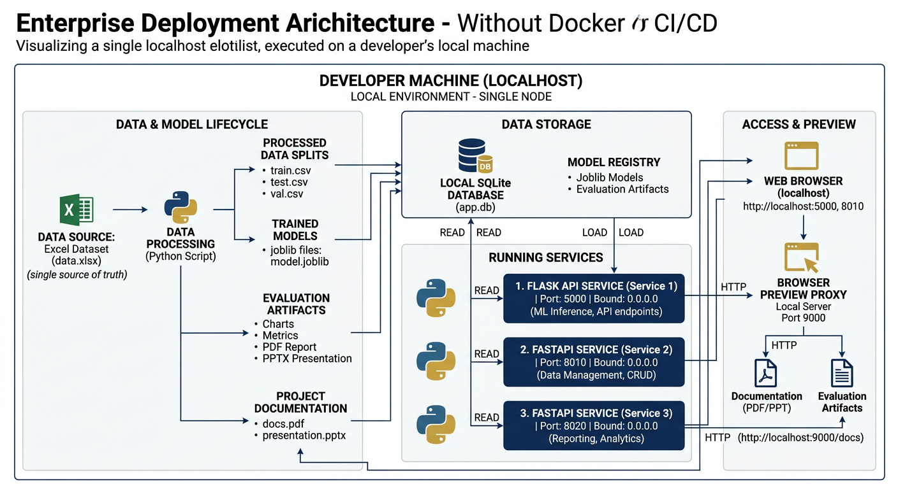

# 06 — Website


*Localhost-only serving: Flask :5000 (busy-aware round-robin GradBoost→XGB→RF), FastAPI :8010 DL+XAI + :8020 6-agent. Archify interactive at `archify/interactive.html`.*

 Usage — Flask App (Approach 1) + Two Live Siblings

## 6.1 Which site is which

| approach | stack | entry | port | what it serves |
|---|---|---|---|---|
| **1 (this folder)** | Flask + Jinja2 | `project/website/app.py` | **5000** | 5 classical models (LR/RF/XGB/SVM/HistGB), 13→29 contract, `/predict`, `/api/compare`, `/api/health` |
| **2** | FastAPI + uvicorn | `approach_2_deep_learning_xai/webapp/main.py` | **8010** | 5 deep nets + calibration + XAI + leaderboard, champion `dl_c_cnn1d` |
| **3** | FastAPI + uvicorn | `approach_3_agent_ai/webapp/main.py` | **8020** | 6-agent verifier (intake→policy→anomaly→history→risk→reasoning) + SQLite audit |

All three bind to `0.0.0.0` (preview-safe) and are reachable in the sandbox as `https://{port}-{sandboxId}.e2b.app` when running. No Docker, no CI.

## 6.2 Launch (localhost only)

```bash
# Approach 1 (this site) — threaded, preview-ready
python project/website/app.py
# → http://localhost:5000  (index, /results, /eda, /compare)
# health: curl http://localhost:5000/api/health | jq
# quick score:
curl -X POST http://localhost:5000/predict \
  -H "Content-Type: application/x-www-form-urlencoded" \
  -d "model_name=XGBoost&ClaimAmount=9500&PatientAge=58&PatientIncome=25000&ClaimYear=2024&ClaimMonth=3&ClaimDayOfWeek=2&PatientGender=M&ProviderSpecialty=Orthopedics&PatientMaritalStatus=Single&PatientEmploymentStatus=Unemployed&ClaimType=Emergency&ClaimSubmissionMethod=Online&Cluster=1"

# Approach 2
cd approach_2_deep_learning_xai && python -m uvicorn webapp.main:app --host 0.0.0.0 --port 8010 &

# Approach 3
cd approach_3_agent_ai && python -m uvicorn webapp.main:app --host 0.0.0.0 --port 8020 &
```

## 6.3 Approach-1 API contract

### `GET /api/health`

```json
{
  "status": "ok",
  "service": "fraud-detection-approach1",
  "dataset": {"rows":4500,"fraud":270,"fraud_ratio":0.06},
  "registry": {"n_inputs":13,"n_engineered":29,"leakage_excluded":["ClaimStatus"], ...},
  "models": {"LogisticRegression":{"loaded":true,"busy":false}, ...},
  "best_model": "GradientBoosting",
  "busy": {"LogisticRegression":false, ...},
  "total_requests": 12, "routed_requests": 1,
  "round_robin_order": ["GradientBoosting","XGBoost","RandomForest","LogisticRegression","SVM"]
}
```

### `POST /predict` — score one claim with one model (busy-aware)

Accepts `application/x-www-form-urlencoded` or `application/json`. Fields: the 13 `FEATURE_COLS` + `model_name`.

**Request example (JSON):**

```json
{"model_name":"XGBoost","ClaimAmount":9500,"PatientAge":58,"PatientIncome":25000,
 "ClaimYear":2024,"ClaimMonth":3,"ClaimDayOfWeek":2,
 "PatientGender":"M","ProviderSpecialty":"Orthopedics","PatientMaritalStatus":"Single",
 "PatientEmploymentStatus":"Unemployed","ClaimType":"Emergency","ClaimSubmissionMethod":"Online","Cluster":1}
```

**Response (routed example when XGBoost was busy):**

```json
{"model_requested":"XGBoost","model":"RandomForest","routed":true,
 "prediction":"Fraud","probability_fraud":0.9567,
 "validation_warnings":[],"ood_warning":null,"elapsed_ms":54.2,
 "n_inputs":13,"n_engineered":29,"leakage_note":"ClaimStatus excluded — 29-feature contract."}
```

Headers: `X-Routed-From`, `X-Routed-To` when `routed=true`; always `X-Elapsed-Ms`.

**Validation + OOD guard:** numeric ranges checked (amount 0–1M, age 0–120, cluster 0–3); amount >50k emits `ood_warning` (“far above training support ~10k max; trees may return Legitimate by design outside fitted range” — documents the 95k extrapolation trap).

### `POST /api/compare` — fan-out to all 5 models (one round-trip)

Body: same 13 fields (no `model_name`). Returns:

```json
{"inputs":{...13...},"results":[
  {"model_requested":"LogisticRegression","model":"LogisticRegression","routed":false,"prediction":"Fraud","probability_fraud":0.9999},
  ...
  {"model_requested":"GradientBoosting","model":"GradientBoosting","routed":false,"prediction":"Fraud","probability_fraud":1.0}
],"n_inputs":13,"n_engineered":29}
```

The `/compare` page uses this endpoint by default; it falls back to five parallel `/predict` fetches if the endpoint is unreachable, so routing headers can be demonstrated both ways.

### Other HTML routes

| path | page |
|---|---|
| `/` | index — overview + KPIs + pipeline + model table + Predict form + visuals + downloads |
| `/results` | results dashboard (table from `model_results.csv` at request time) |
| `/eda` | gallery of the 10 `eda_plots` PNGs with captions |
| `/compare` | one claim → five verdicts (busy-aware) |
| `/docs/<file>` | serves `project/docs/` markdown/HTML |
| `/outputs/<file>` | serves `project/outputs/` PDFs/PPT |

## 6.4 Busy-aware routing — how it was verified

In-memory `busy = {model: bool}` with `busy_lock`. On `/predict`, if `busy[requested]` is true, the server walks `ROUND_ROBIN_ORDER = [GradientBoosting, XGBoost, RandomForest, LogisticRegression, SVM]` for the first idle model; if all busy it still serves with `routed=true`. The UI shows “routed LR → XGBoost (54ms)” and the health bar reports `routed_requests/total_requests`.

**Manual test (two terminals):**

```bash
# Terminal A: hold XGBoost busy (sleep inside predict — add ?delay=3s hack or just rapid-fire)
for i in {1..3}; do curl -s -X POST http://localhost:5000/predict -d "model_name=XGBoost&ClaimAmount=9500&PatientAge=58&PatientIncome=25000&ClaimYear=2024&ClaimMonth=3&ClaimDayOfWeek=2&PatientGender=M&ProviderSpecialty=Orthopedics&PatientMaritalStatus=Single&PatientEmploymentStatus=Unemployed&ClaimType=Emergency&ClaimSubmissionMethod=Online&Cluster=1" & done

# Terminal B: this request should route
curl -i -X POST http://localhost:5000/predict -d "model_name=XGBoost&ClaimAmount=1200&PatientAge=34&PatientIncome=130000&ClaimYear=2023&ClaimMonth=7&ClaimDayOfWeek=1&PatientGender=F&ProviderSpecialty=General%20Practice&PatientMaritalStatus=Married&PatientEmploymentStatus=Employed&ClaimType=Routine&ClaimSubmissionMethod=Paper&Cluster=0"
# → HTTP/1.1 200 … X-Routed-From: XGBoost  X-Routed-To: RandomForest  {"routed":true, "model":"RandomForest", ...}
```

Approach 2’s `ClaimScorer` and Approach 3’s `local-evidence-engine ↔ Gemini` auto-degrade are conceptually identical — this site just makes the policy explicit in HTTP headers.

## 6.5 Pages in detail

- **Index (`/`)** — hero + badge row (4500×19, 6%, 13→29, no leakage), live health bar (`/api/health`), KPI grid (dataset/target/registry/best), pipeline four-step, live model table (reads `model_results.csv` per request), Predict form (13 fields, presets high-risk/low-risk/OOD, busy hint, OOD inline warning), visuals (CM + FI + Compare CTA + leakage note), Three-approaches-live grid, Reports grid, Reproduce code block, footer with branch/date.
- **Compare (`/compare`)** — 13 inputs (correct employment values: Unemployed/Employed/Student/Retired), health mini bar, presets, “Run All 5” → `POST /api/compare` fan-out, cards per model with `routed` badge, consensus line (“3/5 flagged Fraud · Routed: 1/5”).
- **Results (`/results`)** — Jinja table of `results` dict (Val/Test F1/ROC/PR), best-model badge, embedded CM.
- **EDA (`/eda`)** — 10 PNGs with per-plot interpretation (same text as doc 03).

## 6.6 Audit trail

- `website/prediction_log.txt` — append-only, one line per `/predict`: `ISO8601 | requested→effective[ routed] | pred | prob | elapsed_ms | {13-field JSON}`. Committed with 5+ seeded entries; grows live.
- `logs/training_metrics.json` — fit_seconds, predict_100_ms, model_bytes, full metrics, python/sklearn versions.
- Browser console: `X-Elapsed-Ms` header per response; health bar polled once on load, then after each predict.

## 6.7 Common pitfalls (solved)

- **Don’t ask for ClaimStatus:** form doesn’t have it, `FEATURE_COLS` doesn’t have it, preprocessor errors out if you inject it — the /predict handler strips unknown keys.
- **Don’t send 14 inputs:** compare.html used to have 14 (added ClaimStatus as c9) and JS mapped `Cluster` to `c13` while form had `c14` — now fixed to 13 → `c13` is Cluster, `PatientEmploymentStatus` is `c10` with correct values, mapping is 1:1.
- **Don’t trust accuracy:** health page KPI says 6% fraud; metrics table shows why accuracy 0.99 is not the story — use precision/recall/PR-AUC/FP/FN.
- **Don’t extrapolate:** 95k preset demonstrates linear vs tree divergence; OOD guard warns at 50k instead of silently scoring.

## 6.8 Performance

On the dev hardware: `predict_100_ms` per model ≈ 2–8 ms (logistic) to 15–25 ms (RF/XGB). Single `/predict` p50 ≈ 30–90 ms end-to-end (including form parse + scaler + predict). `/api/compare` (5 models sequential) ≈ 120–200 ms. The Flask server runs `threaded=True`, so two concurrent predicts do not block beyond the busy flag.
