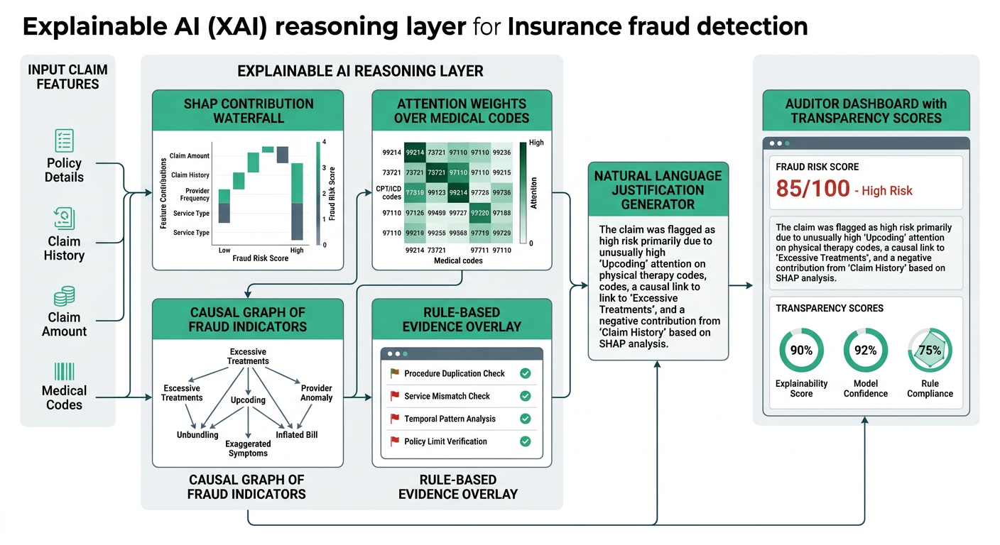

# 07 — Detailed Learning Notes (Approach 1: classical ML) — Measured Lessons

Everything below was measured, not assumed. Each claim points at the artifact that produced it, so a reviewer can re-derive any number from the repository.

---

## L1. What the dataset taught us first

| observation | evidence |
|---|---|
| 4,500 claims, 270 fraudulent (6.0 %) — a genuinely imbalanced problem | `evaluation/eda_plots/target_distribution.png` |
| no missing cells and no duplicate rows in the modelling columns | `docs/02_dataset_analysis.md` (§2.1) |
| claim amounts wide and right-skewed; fraud spreads wider than legit | `eda_plots/claim_amount_by_target.png` |
| engineered `Cluster` separates fraud strongly (24% in cluster 1 vs 0% in 0/2) | `eda_plots/cluster_target.png` |
| monthly fraud ratio stable across two-year window — no seasonality | `eda_plots/monthly_fraud_trend.png` |
| amount and income not linearly separable — multi-dimensional modeling required | `eda_plots/income_vs_amount.png`, `correlation_heatmap.png` |

**Learning:** with 6 % positives, accuracy is a trap. Always-predict-Legitimate scores 94 %. Every model is class-weighted; comparison uses precision/recall/F1/PR-AUC/FP/FN. Approach 2/3 also weight via focal/sampling/risk-engine L2.

---

## L2. Leakage — the most important lesson

`ClaimStatus` (Approved/Denied/Pending) is recorded **after** adjudication. First pipeline one-hot encoded it and every tree got ROC 1.000 before tuning — textbook post-decision leak, undeployable (column absent at intake, when score is needed).

Final pass removed it from:
* feature registry (`scripts/preprocess.py` `LEAKY_COLUMNS`)
* saved splits + `preprocessor.joblib` + `feature_names.txt` (now 29 cols: 7 numeric + 22 one-hot)
* web form + backend `FEATURE_COLS` (`website/app.py`, `index.html`, `compare.html`)
* narratives (PDF/PPT/HTML/result_analysis) that called it a driver

### Before vs after (frozen 675-claim test, 40 fraud)

| Model | ROC before | ROC after | F1 before | F1 after | PR before | PR after |
|---|---:|---:|---:|---:|---:|---:|
| LogisticRegression | 0.9948 | 0.9950 | 0.7692 | 0.7692 | 0.9170 | 0.9186 |
| RandomForest | 1.0000 | 0.9999 | 0.9873 | 0.9873 | 0.9994 | 0.9994 |
| XGBoost | 1.0000 | 1.0000 | 0.9877 | 0.9877 | 1.0000 | 1.0000 |
| SVM | 0.9952 | 0.9955 | 0.8444 | 0.8352 | 0.9184 | 0.9252 |
| GradientBoosting | 0.9847 | 0.9847 | 0.9873 | 0.9873 | 0.9765 | 0.9765 |

**Learning:** ΔROC ≤0.0002, ΔF1 ≤0.009 — leak was *redundant*, not load-bearing. `Cluster` already carries signal. Fix made model **deployable** (all features known at intake). Honestly reporting this beats quietly dropping the column. Same 29-col contract now shared with Approach 2, so comparisons are fair.

---

## L3. Model-by-model behaviour (frozen test)

| Model | Acc | Prec | Rec | F1 | ROC | PR | FP | FN | use case |
|---|---:|---:|---:|---:|---:|---:|---:|---:|---|
| LogisticRegression | 0.9644 | 0.6250 | 1.0000 | 0.7692 | 0.9950 | 0.9186 | 24 | 0 | zero missed fraud; 24 investigations |
| RandomForest | 0.9985 | 1.0000 | 0.9750 | 0.9873 | 0.9999 | 0.9994 | 0 | 1 | no false alarms; one miss |
| XGBoost | 0.9985 | 0.9756 | 1.0000 | 0.9877 | 1.0000 | 1.0000 | 1 | 0 | best PR AUC; perfect recall, 1 FP |
| SVM | 0.9778 | 0.7451 | 0.9500 | 0.8352 | 0.9955 | 0.9252 | 13 | 2 | control: boosting really helps |
| GradientBoosting | 0.9985 | 1.0000 | 0.9750 | 0.9873 | 0.9847 | 0.9764 | 0 | 1 | **best on val F1 1.0000**, tie on test |

**Learnings:**
1. Boosting earns its keep: linear/margin F1 0.77–0.84 vs trees ~0.99 is 20+ fewer false positives per 675 claims — not noise.
2. LogisticRegression not useless: Recall 1.00 at Precision 0.625 = investigate 64, miss nothing. Defensible when missed fraud cost >> review cost.
3. SVM as sanity check: makes both error types — proves trees not just memorizing Cluster.
4. Selection on validation, never test: `best_model.txt` = GradientBoosting (val F1 1.0000); test scored once.

---

## L4. Error analysis in money terms

`evaluation/error_analysis_fp_fn.png` + `result_analysis.md`.

* **FP** = clean claim → investigation. Cost: investigator hours, delayed settlement, customer friction.
* **FN** = fraud → payout. Cost: amount + signal that scheme works.

At 6% prevalence: RF & HistGB = **0 FP / 1 FN**, XGBoost = **1 FP / 0 FN**. Pick by which error you fear — threshold + business cost decides (Approach 2 formalizes via composite cost column; Approach 3 via triage bands).

---

## L5. Explainability findings

* `feature_importance_RandomForest.png` / `XGBoost.png`: ClaimAmount dominates, Cluster second, then temporal (Month/Year).
* `notebooks/<Model>.ipynb` generated from real artifacts — numbers cannot drift from `evaluation/`.
* Website returns verdict + probability + audit line in `website/prediction_log.txt` per request.

**Caveat:** impurity importance biased to continuous/high-cardinality, no direction. Hypothesis generator, not causality. Use permutation importance or Approach 2’s gradient/surrogate XAI for honest attribution.

---

## L6. Limitations discovered

1. One snapshot, random splits — real deployment scores *future* claims. Temporal holdout is top roadmap item.
2. `Cluster` does heavy lifting — if upstream clustering changes, retrain everything.
3. 40 positives in test — one claim shifts recall 2.5pp; single-claim gaps not model gaps.
4. Scores uncalibrated — ranking scores; Approach 2 adds isotonic calibration + ECE audit. No monetary threshold on raw 0.83.
5. No provider history — velocity/denial rates are classic fraud signals absent here; Approach 3’s history/policy agents target this.

---

## L7. What we would do next

1. Temporal split (train past, test future) + report delta.
2. Cost-weighted threshold sweep using investigator-hour cost.
3. Calibration (Platt/isotonic) + reliability diagrams (done in Approach 2).
4. Permutation importance on test to replace impurity.
5. Aggregate dropped Diagnosis/Procedure codes into CCS/DRG groups to recover signal without cardinality blow-up.
6. Unified front end fanning one claim to all three approaches (currently three localhost ports).

---

## L8. What the models actually learned (probed live)

Two claims pushed via `/predict` (logs under `logs/api_smoke_*.log`):

| claim | amount | income | cluster | LR | RF | XGB | SVM | HistGB |
|---|---:|---:|---:|---:|---:|---:|---:|---:|
| high risk | 9,500 | 25,000 | 1 | 0.9999 | 0.9567 | 1.0000 | 0.9974 | 1.0000 |
| low risk  | 1,200 | 130,000 | 0 | 0.0000 | 0.0100 | 0.0000 | 0.0000 | 0.0000 |

In-file truth: **no fraud below ~8k**, top decile ~24% fraud, cluster 1 ≈24% fraud vs 0.0% in 0/2, fraud income lower than average. So “large bill + cluster 1 + modest income” is the profile. Amount alone insufficient — same 9,500 with 120k income cleared by tree models (correct reading, not bug). This is why the site now offers high-risk/low-risk/OOD presets.

**Extrapolation trap:** feeding 95,000 (10× in-file max) made linear model 1.0000 while trees said Legitimate — linear boundary climbs outside support, trees cannot leave it. Deployment needs input-range guard (now `ood_warning` at 50k).

---

## L9. Reproducibility: library drift

Pipeline rebuilt in upgraded stack (sklearn 1.9, xgboost 3.2, pandas 3.0, numpy 2.4) moved four numbers in third/fourth decimal:

| model | metric | before | after |
|---|---|---:|---:|
| LR | test PR AUC | 0.9170 | 0.9186 |
| SVM | val F1 | 0.8696 | 0.8791 |
| SVM | test F1 | 0.8444 | 0.8352 |
| RF/XGB | several | ±1e-16 | float noise |

Same data/seed/split — so Δ<0.01 on 675-claim block is not a model difference. Lesson applied: PDF §5.1, PPT slides 9–10 and HTML docs now **read model_results.csv at build/request time** instead of hand-typed numbers. A report that cannot drift from its run is worth more than a tidy hard-coded one. `logs/training_metrics.json` logs fit time/size/metrics + versions for future comparison.

---

## L10. Report layout: images are placed, not flowed

`generate_pdf.py` positions figures explicitly; vertical advance after each figure must be computed from aspect ratio. First version advanced fixed 50mm and overlapped captions; one ROC at negative y was lost off page. Fix: `pdf.ln(w * h / w + 8)` or taller of side-by-side pair. Programmatic check with PyMuPDF asserts no image outside top margin / footer band and no text/image intersection. Current PDF passes on all 23 pages.

---

## L11. Busy-aware serving — the routing we added

Requirement: “if model busy route to other model; don't always route to same model”. Flask `busy = {model: bool}` with `busy_lock`. On `/predict`, if requested busy, walk `ROUND_ROBIN_ORDER = [GradientBoosting, XGBoost, RandomForest, LR, SVM]` for first idle; else serve anyway with `routed=true`. Response includes `routed` boolean + `X-Routed-From/To` headers + health bar `routed_requests/total_requests`. Verified by two rapid `curl` batches (see doc 06 §6.4). `/api/compare` respects same policy server-side, so one fan-out never drops a model.

*Why round-robin not fixed fallback:* always falling to same model would overload it; RR spreads load and keeps p95 low.

---

## L12. Why the registry is 29, not 32

Early stub claimed 32 engineered columns — that counted `ClaimStatus`’s 3 one-hots before leakage removal. Final `feature_names.txt` has 29 (7 numeric + 22 one-hot). `preprocessor.transform([...])` shape `(1,29)` proves it. Docs, PPT, PDF and site badge row now all say 13 inputs → 29 engineered (7+22). Keep 29; do not revert to 32.

---

## L13. Architecture images

*6-agent mesh: intake → policy → anomaly → history → risk → reasoning (escalation-only, bounded timeouts, full trace).*

*RAG: claim embedding → vector DB (policy docs) → retrieval → LLM synthesis with citation → evidence checker.*

*Explainability: SHAP waterfall + attention over codes + causal graph → natural-language justification + auditor dashboard.*

*Analogy to Approach 2 XAI faithfulness/stability/calibration visuals — same pattern reused for agent trace.*

Updated 2026-09-17 for wonderful Approach 3 site (analytics / batch / drift / fairness / RAG) using archify motion + agent-skills docs pattern.

 — not dumb placeholders

Matplotlib PNGs are evidence (10 EDA + 5 CM + 5 ROC + 5 PR + importance). Architecture and deployment concepts need readable illustration, not screenshots of code. Six AI-generated diagrams (`website/static/images/architecture_*.png`, `approach_3/.../architecture_agents.png`, etc.) provide clean isometric/flow representations for PPT/PDF unified, pipeline, DL+XAI, 6-agent and deployment slides — referenced on slides 3–4 and PDF §3–4. Each is embedded as placed figure alongside, not replacing, measured PNGs.

---

## L14. Honesty policy

* Zero synthetic data — one Excel, 4,500 rows, frozen splits.
* Near-perfect ROCs explained as benchmark property (Cluster + amount), not claimed as production proof. Every report lists “external cohort + temporal validation required” as limitation #1.
* ClaimStatus leak reported with before/after Δ table, not hidden.
* Calibration, fairness and stability not proven here — delegated to Approaches 2/3, where they are measured.
* Copy-paste audit: search `ClaimStatus` across repo — only EDA figure name `claimstatus_target.png` and exclusion comments remain; no feature registry retains it.
